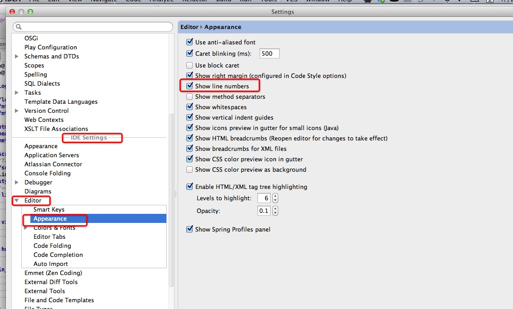
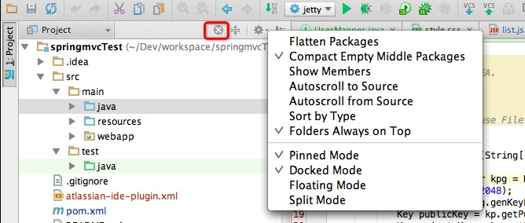

个人使用IntelliJ其实并不太久，但是用了这段时间觉得的确很是好用，刚刚从Eclipse转过来的很多人开始可能很不适应，我这里就把我使用过程中的一些经验和一些常用的快捷键说下，当然在看这篇之前你需要先看完[IntelliJ IDEA 的 20 个代码自动完成的特性](http://www.oschina.net/question/12_70799),这篇翻译过来的文章对自动完成部分介绍的很好了,只是快捷键说明部分还可以更完善一些,可以照顾下默认绑定键位不一致的同鞋。本文在说明快捷键的时候会根据Mac OSX 10.5+的默认keymap来使用，当然也会提供相关的文字说明，如果和我的绑定不一致的可以直接去keymap中去搜索即可。

## 基本设置
### 显示行号
这个以前在Eclipse中是个很简单的问题,转移到IntelliJ上以后的一些人也问过这个问题,使用同样的方式设置了以后发现只是对当前文件起作用了,打开另外一个文件依然没有行号,就好比你只是在vim中执行命令`set number`,而不是在.vimrc中设置一样的效果.这个是需要在IDE Settings中设置下的,如图所示勾选即可:
    
其他设置可参照该设置项勾选即可,例如显示空格等等.

### 文件和导航关联
我们在写代码的时候经常需要打开某个文件的时候,想在左边的文件目录上自动打开当前所在的目录,这样很方便的找寻本目录下的其他文件或者其他的相关文件,其实这个IntelliJ提供了好几种解决方案,第一个就是和Eclipse一样的方式,如下:

* 以前在Eclipse中设置也很简单,但是IntelliJ里面稍微有点不一样,如果想临时一次的话,打开文件的时候点击下图的小地球图标即可

如果你想和Eclipse的那个一样,让这一切自动的话,那么在上图的浮层中可以看到两个选项`AutoScroll to Source`和`AutoScroll from source`,IntelliJ很人性化的分了两个设置在里面,你两个都勾选就是基本和Eclipse的功能保持了完全一致,只是勾选一个自然也可以.

还有一种方式就是利用IntelliJ提供**Navigation Bar**,这个功能是IntelliJ完全可以键盘化的一个特点之一吧,操作方式就是打开文件的时候,使用快捷键`⌘+UP (Jump to Navigation Bar)`,然后就会出现一个下拉,基本就是这个文件所在目录的文件列表,还可以使用**上下左右的键位**来选择其他目录,是不是很酷?操作好似比vim还更舒服?

**备注:**此处建议把`View > Navigation Bar`的选项点掉,这样就使用快捷键之后就会在你鼠标的位置出现,感觉会更输入一些,当然这样你就基本失去了使用鼠标的权利,这个需要你根据个人癖好使用即可.

## 快捷键使用
如果你是苹果电脑用户的话,建议你改成Mac OSX 10.5+的键位绑定,因为Mac OSX 10.5这个兼容Windows的版本的键位实在是太蹩脚了,用着是真难受,好比你默认习惯`⌘+w`是关闭标签,在这里竟然是选择文本的一个快捷键,当然这个键位是很有意义的.

这里主要介绍几个可能大家常用的,或者是你可能并不知道IntelliJ中有这样的几个快捷键,特别常用的你直接参照官网的Keymap介绍[Getting Started](http://www.jetbrains.com/idea/documentation/index.jsp)就可以了,学会在Keymap中自己查询需要的快捷键是主要的,不要每次都打开那个没用的百度,具体绑定可以参照本文最后给出的链接.
### outline调出
以前在Eclipse中用的很多的一个快捷键就是ctrl+o,这样可以调出Java文件的所有成员变量和方法,并且可以支持搜索很是方便,IntelliJ这种基本的功能自然是有,新手的话还经常问,这个在IntellJ中的快捷键是`⌘+F12 (File Structure)`,如果你不是Mac OSX 10.5+键位绑定的话,小括号中的内容就是你可以去Keymap中去搜索的内容.

###基本操作

* **复制整行或者块:**在Eclipse中使用`ctrl+alt+Up`,IntelliJ默认是`⌘+D (Duplicate Line or Block)`,其实这个和Eclipse中的有差距,尤其是多行的时候或者选中内容的时候,不信你可以试试,所以你可以把Keymap中的`Duplicate Lines`定义上一个快捷键,我定义的是`Shift+D`,这个键位在我的默认绑定中是没任何快捷键的,你可以自己绑定一个试试.
* **根据符号选择文本:**这个键位用的太多了,并且也是非常的好用,举个例子,有这样一行代码`<name>SpringSource Milestones Proxy</name>` 你光标在Milestones中的某一个位置,你想替换`SpringSource Milestones Proxy`为其他单词,假设想替换为`Test XX`,其实这样你只需要`Option+Up (Select Word at Caret)`两下就可以选中你想要的单词了,当你想在开发过程中,你会发现这个键位用的太多了,多到换了其他没有这个键位的编辑器或者IDE上,很是不习惯.
* **删除整行:** 可以直接`⌘+delete (Delete Line)`或者利用IntelliJ智能的功能,剪切的快捷键,当本行选中文本的时候剪切``⌘+x`会按照选中的文本实现剪切,但是你本行内无任何选中文本的时候会自动剪切整行,那么自然就类似一个删除本行的快捷键,但是这个其实还是比较蹩脚的,建议使用`⌘+delete`.
* **想直接跳转到接口的实现方法:** `⌘+option+鼠标单击`或者`⌘+option+B`.
* **语句自动完成 Statements completion:**这个在[IntelliJ IDEA 的 20 个代码自动完成的特性](http://www.oschina.net/question/12_70799)中已经说明,这里还是着重说下,因为的确很好用,也强烈推荐下,还有文中说的`智能自动完成 ⌘+shift+Space`,当给你的提示太多的时候,这个键绝对会给你惊喜.

##版本控制设置
我们开发肯定是有版本控制的，大家以前Eclipse的时候在本地文件和版本库不一致的时候，那么文件以及所在的文件夹都会出现一个`〉`表示，大家能很轻松的看到本地文件修改了哪一些，但是IntelliJ中默认是不能这样的，只是给文件在修改的时候提供了颜色上的变化，如果想和Eclipse一样的话需要如下图把设置勾选就可以了

其实看英文解释就可以明白了，这个默认开启以后如果想调整文件夹的显示颜色的时候就直接去`Settings > Editor > Colors & Fonts > File Status`中调整即可了，可以调整成自己喜欢的样子。

##Java资源文件非英文的情况显示
IntelliJ在资源文件这方面个人觉得也是完胜Eclipse的，在Resource Bundle方式下想修改一个属性是相当方便的，可以在一个操作界面上修改所有语言的属性，这一切都是自动完成的，如下图所示：

并且还很贴心的有一个排序和分组的功能，尤其是这个排序。但是在默认设置下中文的是默认显示为Unicode码的，其实勾选一个设置(`Settings > File Encodings`)就可以了，如下图：

这样设置以后所有Unicode显示的自动转化为其应该显示的语言了.

## 符合Maven约定结构的web项目如何更好的运行
记得刚开始用Eclipse的时候那时候默认是不支持Java EE项目的,必须使用一个MyEclipse的插件,直到今天好似还有人在用这个玩意,当年的时候每个Web项目修改之后都必须Deploy一下,修改的东西才会被执行,很是痛苦,后来就自己利用Tomcat插件,这个可以保证你修改jsp以及静态文件的时候不需要Deploy直接就可以被执行,因为Tomcat的目录指向其实直接是指向到了你的项目文件,这样的确省心了很多.

在IntelliJ中如果你是传统的Java EE的结构(根目录下面有src,webMoudle这样的结构),那么在直接在Run Configurations中添加一个Tomcat即可,点击+号添加即可(当然需要注意虽然没搜索框,你输入字符会自动给你筛选结果),这样运行的时候修改Java文件的话需要主动Make Project也就是`⌘+F9 (Make Project)`.但是如果你是符合maven约定的项目结构的话如果继续这样配置就很不理想了,每次修改了jsp文件竟然也需要Make Project才可以,因为每次Make Project以后IntelliJ会自动给你DeployMent,这样好似又回到了几年前那种很麻烦的环境.

这个问题其实很容易解决,就是不要使用这种方式来运行你的web项目,既然符合maven结构的项目自然是使用maven或者gradle这种构建工具了,那么你需要利用maven的jetty的插件来运行项目即可了,如下图配置即可:

当然你也可以如下图直接点击运行就会自动添加一个了

参看上图其实也没必须非用jetty,用tomcat6或者tomcat7的插件运行也可以.

## 注意事项
1. IntelliJ对于文件是默认随时保存的,基本不需要你`⌘+s`,所以需要注意不要随手不小心把某个文件改了下,然后直接关闭标签了,其实你的无意的操作已经导致修改了文件,可能导致你在项目运行的时候发现一个很离奇的错误,我暂时没发现可以关闭自动保存的设置,如果你对此非有强迫症的话,vim的插件可能会帮助到你.
2. IntelliJ中的文件是实时和本地文件同步的,所以Eclipse的刷新功能就不要问了,因为这东西根本不需要那个功能.有的编辑器会提醒你是否和本地文件更新,这里也是默认不给任何提醒的,只要你修改了,这里就会同步更新.
3. 在主菜单`File`下面,有个奇怪的Power Save Mode,这里也说明下,这个顾名思义是省电模式.当你勾选此模式以后,IntelliJ不会给你完成任何自动完成的功能,例如本来你输入一个字符会自动提示的,勾选以后就没有了,如果出现此问题的话可以考虑是不是自己手贱点过这个按钮噢,这个还是比较适合开会的适合无聊看代码用的,又省电又不影响你看代码.
4. Eclipse中有个`F2`的功能,可以查看到Java文件定义,你在Spring的配置文件中可能需要配置这个值,但是在IntelliJ中这个是不需要的,因为对于Spring这样的支持很是完善,你只需要在class的属性中输入class的名字然后`ctrl+空格 (Basic 这个在code的completion下面)`自动就完成了全路径,在智能的条件下可能就不需要蹩脚的实现.

## 最后

第一次发文,如果有什么问题欢迎留言交流,文档放在[github](https://github.com/fxl545826/Documents)上,各位如果也有一些技巧不妨共同完善下本文档,只需要Fock然后Pull Request就可以了,如果你觉得有个github帐号过于麻烦,我个人觉得你还是转行比较合适.如果不想更新只是想订阅持续更新的内容,只需要Watch该项目即可,或者Star这样可以在自己的帐号部分快速找到本项目.

## 附录
* Win快捷键 [Win Keymap](http://www.jetbrains.com/idea/docs/IntelliJIDEA_ReferenceCard.pdf)

* Mac OS 快捷键 [Mac OS Keymap](http://www.jetbrains.com/idea/docs/IntelliJIDEA_ReferenceCard_Mac.pdf)