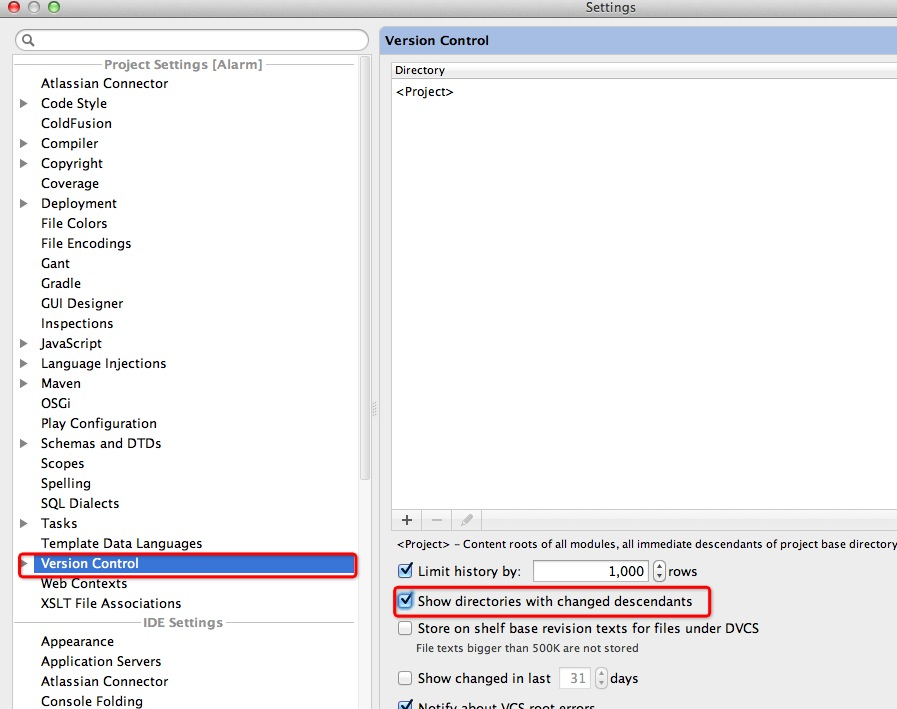
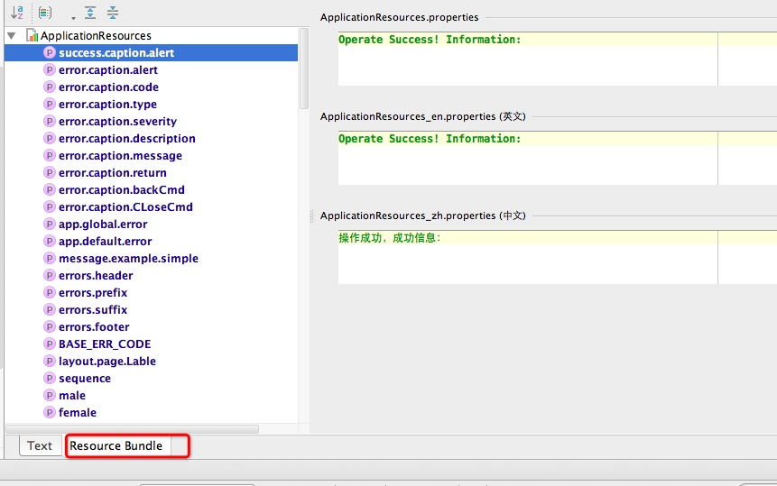
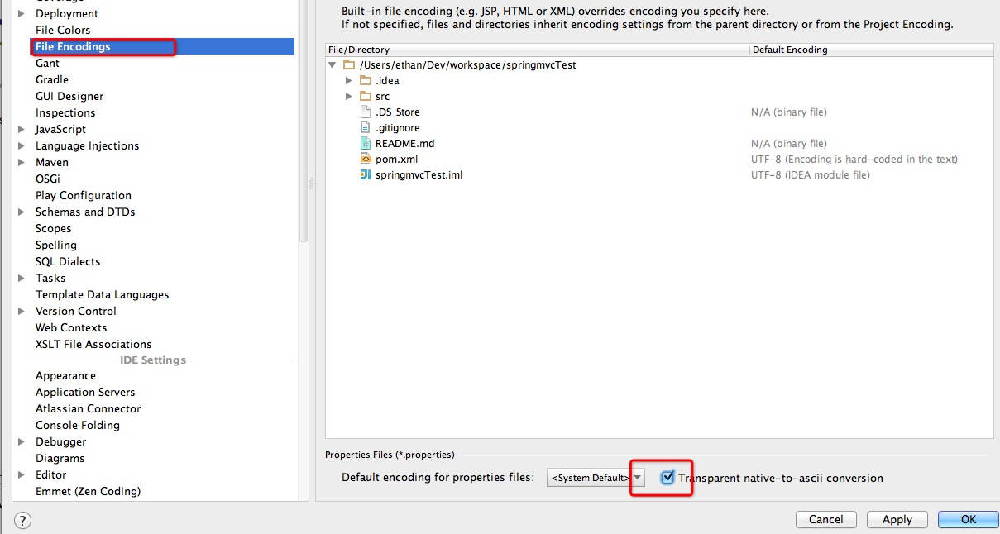
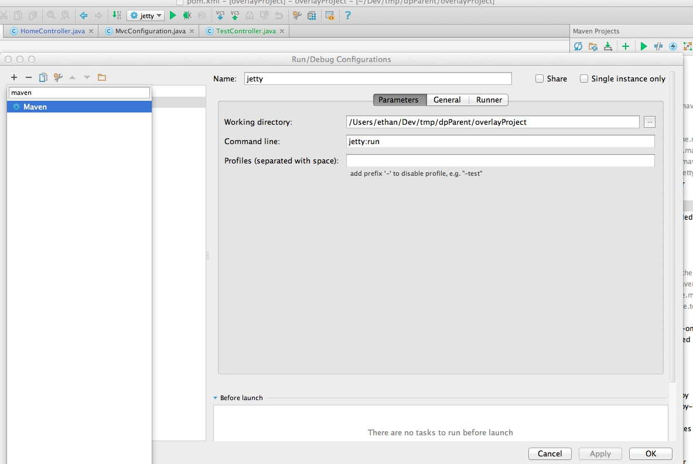
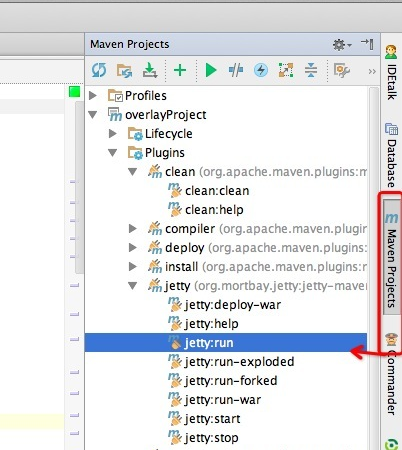

##IntelliJ IDEA使用经验
个人使用IntelliJ其实并不太久，但是用了这段时间觉得的确很是好用，刚刚从Eclipse转过来的很多人开始可能很不适应，我这里就把我使用过程中的一些经验和一些常用的快捷键说下，当然在看这篇之前你需要先看完[IntelliJ IDEA 的 20 个代码自动完成的特性](http://www.oschina.net/question/12_70799),这篇翻译过来的文章对自动完成部分介绍的已经很不错了，只是快捷键说明部分还有待改进。本文在说明快捷键的时候会根据Mac OSX 10.5+的默认keymap来使用，当然也会提供相关的文字说明，如果和我的绑定不一致的可以直接去keymap中去搜索即可。

### 快捷键
如果你是苹果电脑用户的话,建议你改成Mac OSX 10.5+的键位绑定,因为Mac OSX 10.5这个兼容Windows的版本的键位实在是太蹩脚了,用着是真难受,好比你默认习惯`⌘+w`是关闭标签,在这里竟然是选择文本的一个快捷键,当然这个键位是很有意义的.

这里主要介绍几个可能大家常用的,或者是你可能并不知道IntelliJ中有这样的几个快捷键,特别常用的你直接参照官网的Keymap介绍[Getting Started](http://www.jetbrains.com/idea/documentation/index.jsp)就可以了,学会在Keymap中自己查询需要的快捷键是主要的,不要每次都打开那个没用的百度,具体绑定可以参照本文最后给出的链接.
#### outline调出
以前在Eclipse中用的很多的一个快捷键就是ctrl+o,这样可以调出Java文件的所有成员变量和方法,并且可以支持搜索很是方便,IntelliJ这种基本的功能自然是有,新手的话还经常问,这个在IntellJ中的快捷键是`⌘+F12 (File Structure)`,小括号中的内容就是你可以去Keymap中去搜索的内容.

####基本操作方面

* **复制整行或者块:**在Eclipse中使用`ctrl+alt+Up`,IntelliJ默认是`⌘+D (Duplicate Line or Block)`,其实这个和Eclipse中的有差距,尤其是多行的时候或者选中内容的时候,不信你可以试试,所以你可以把Keymap中的`Duplicate Lines`定义上一个快捷键,我定义的是`Shift+D`,这个键位在我的默认绑定中是没任何快捷键的,你可以自己绑定一个试试.
* **根据符号选择文本:**这个键位用的太多了,并且也是非常的好用,举个例子,有这样一行代码`<name>SpringSource Milestones Proxy</name>` 你光标在Milestones中的某一个位置,你想替换`SpringSource Milestones Proxy`为其他单词,假设想替换为`Test XX`,其实这样你只需要`Option+Up (Select Word at Caret)`两下就可以选中你想要的单词了,当你想在开发过程中,你会发现这个键位用的太多了,多到换了其他没有这个键位的编辑器或者IDE上,很是不习惯.
* **删除整行:** 可以直接`⌘+delete (Delete Line)`或者利用IntelliJ智能的功能,剪切的快捷键,当本行选中文本的时候剪切``⌘+x`会按照选中的文本实现剪切,但是你本行内无任何选中文本的时候会自动剪切整行,那么自然就类似一个删除本行的快捷键,但是这个其实还是比较蹩脚的,建议使用`⌘+delete`.
* **调试用到的键位**
* **想直接跳转到接口的实现方法:** `⌘+option+鼠标单击`或者`⌘+option+B`

###VCS部分
我们开发肯定是有版本控制的，大家以前Eclipse的时候在本地文件和版本库不一致的时候，那么文件以及所在的文件夹都会出现一个`〉`表示，大家能很轻松的看到本地文件修改了哪一些，但是IntelliJ中默认是不能这样的，只是给文件在修改的时候提供了颜色上的变化，如果想和Eclipse一样的话需要如下图把设置勾选就可以了

其实看英文解释就可以明白了，这个默认开启以后如果想调整文件夹的显示颜色的时候就直接去`Settings > Editor > Colors & Fonts > File Status`中调整即可了，可以调整成自己喜欢的样子。

###Java资源文件非英文的情况显示
IntelliJ在资源文件这方面个人觉得也是完胜Eclipse的，在Resource Bundle方式下想修改一个属性是相当方便的，可以在一个操作界面上修改所有语言的属性，这一切都是自动完成的，如下图所示：

并且还很贴心的有一个排序和分组的功能，尤其是这个排序。但是在默认设置下中文的是默认显示为Unicode码的，其实勾选一个设置(`Settings > File Encodings`)就可以了，如下图：

这样设置以后所有Unicode显示的自动转化为其应该显示的语言了.

### 符合Maven约定结构的web项目如何更好的运行
记得刚开始用Eclipse的时候那时候默认是不支持Java EE项目的,必须使用一个MyEclipse的插件,直到今天好似还有人在用这个玩意,当年的时候每个Web项目修改之后都必须Deploy一下,修改的东西才会被执行,很是痛苦,后来就自己利用Tomcat插件,这个可以保证你修改jsp以及静态文件的时候不需要Deploy直接就可以被执行,因为Tomcat的目录指向其实直接是指向到了你的项目文件,这样的确省心了很多.

在IntelliJ中如果你是传统的Java EE的结构(根目录下面有src,webMoudle这样的结构),那么在直接在Run Configurations中添加一个Tomcat即可,点击+号添加即可(当然需要注意虽然没搜索框,你输入字符会自动给你筛选结果),这样运行的时候修改Java文件的话需要主动Make Project也就是`⌘+F9 (Make Project)`.但是如果你是符合maven约定的项目结构的话如果继续这样配置就很不理想了,每次修改了jsp文件竟然也需要Make Project才可以,因为每次Make Project以后IntelliJ会自动给你DeployMent,这样好似又回到了几年前那种很麻烦的环境.

这个问题其实很容易解决,就是不要使用这种方式来运行你的web项目,既然符合maven结构的项目自然是使用maven或者gradle这种构建工具了,那么你需要利用maven的jetty的插件来运行项目即可了,如下图配置即可:

当然你也可以如下图直接点击运行就会自动添加一个了

参看上图其实也没必须非用jetty,用tomcat6或者tomcat7的插件运行也可以.

### 常见问题

1. Power Save Mode是干嘛的?    
	这个顾名思义是省电模式,在主菜单`File`下面,当你勾选此模式以后,IntelliJ IDEA不会给你完成任何自动完成的功能,例如本来你输入一个字符会自动提示的,勾选以后就没有了,如果出现此问题的话可以考虑是不是自己手贱点过这个按钮噢.

### 最后
第一次发文,如果有什么问题欢迎留言交流,文档放在github上,也欢迎各位把自己的心得能共同整理出来给后来者查看.
### 附录
* Win快捷键 [Win Link](http://www.jetbrains.com/idea/docs/IntelliJIDEA_ReferenceCard.pdf)

* Mac OS 快捷键 [Mac OS Link](http://www.jetbrains.com/idea/docs/IntelliJIDEA_ReferenceCard_Mac.pdf)